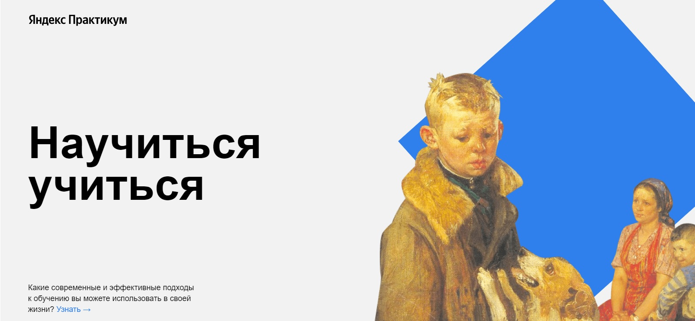

# Научиться учиться

Данный проект является учебным и служит для закрепления практических навыков вёрстки. Он представляет из себя простой неадаптивный одностраничный сайт из 11 блоков с информацией о том, как учиться эффективнее.

## [Демонстрация сайта](https://8gato8.github.io/how-to-learn/)

**Использованы следующие методы и технологии:**

- HTML.
- CSS.
- Flexbox.
- [Методология BEM](https://ru.bem.info/methodology/ "Использована классическая схема организации файловой структуры БЭМ-проектов: Nested").

## Статус проекта и планы по доработке
Завершён. Доработки не планируются.

